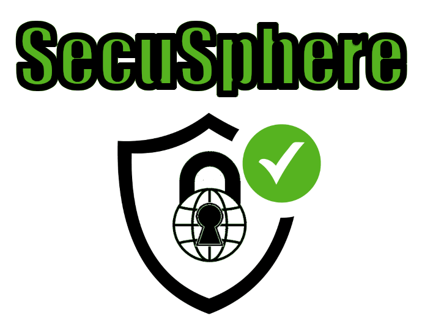

<div align="center">
  
  <h2 align="center">SecuSphere</h2>
  <p align="center">Your Comprehensive DevSecOps Solution</p>
</div>

---

<div align="center">


[](https://www.gnu.org/licenses/gpl-3.0)


</div>

---

Welcome to SecuSphere, your one-stop solution for all DevSecOps needs. Our centralized platform is expertly designed to manage and optimize your vulnerability management, CI/CD pipeline integration, security assessments, and DevSecOps practices.


SecuSphere is a comprehensive DevSecOps platform designed to streamline and enhance your organization's security posture throughout the software development life cycle. Our platform serves as a centralized hub for vulnerability management, security assessments, CI/CD pipeline integration, and fostering DevSecOps practices and culture.

##### Centralized Vulnerability Management

At the heart of SecuSphere is a powerful vulnerability management system. Our platform collects, processes, and prioritizes vulnerabilities, integrating with a wide array of vulnerability scanners and security testing tools. Risk-based prioritization and automated assignment of vulnerabilities streamline the remediation process, ensuring that your teams tackle the most critical issues first. Additionally, our platform offers robust dashboards and reporting capabilities, allowing you to track and monitor vulnerability status in real-time.

##### Seamless CI/CD Pipeline Integration

SecuSphere integrates seamlessly with your existing CI/CD pipelines, providing real-time security feedback throughout your development process. Our platform enables automated triggering of security scans and assessments at various stages of your pipeline. Furthermore, SecuSphere enforces security gates to prevent vulnerable code from progressing to production, ensuring that security is built into your applications from the ground up. This continuous feedback loop empowers developers to identify and fix vulnerabilities early in the development cycle.

##### Comprehensive Security Assessment

SecuSphere offers a robust framework for consuming and analyzing security assessment reports from various CI/CD pipeline stages. Our platform automates the aggregation, normalization, and correlation of security findings, providing a holistic view of your application's security landscape. Intelligent deduplication and false-positive elimination reduce noise in the vulnerability data, ensuring that your teams focus on real threats. Furthermore, SecuSphere integrates with ticketing systems to facilitate the creation and management of remediation tasks.

##### Cultivating DevSecOps Practices

SecuSphere goes beyond tools and technology to help you drive and accelerate the adoption of DevSecOps principles and practices within your organization. Our platform provides security training and awareness for developers, security, and operations teams, helping to embed security within your development and operations processes. SecuSphere aids in establishing secure coding guidelines and best practices and fosters collaboration and communication between security, development, and operations teams. With SecuSphere, you'll create a culture of shared responsibility for security, enabling you to build more secure, reliable software.

Embrace the power of integrated DevSecOps with SecuSphere – secure your software development, from code to cloud.

## 🌟 Features

- **Vulnerability Management**: Collect, process, prioritize, and remediate vulnerabilities from a centralized platform, integrating with various vulnerability scanners and security testing tools.
- **CI/CD Pipeline Integration**: Provide real-time security feedback with seamless CI/CD pipeline integration, including automated security scans, security gates, and a continuous feedback loop for developers.
- **Security Assessment**: Analyze security assessment reports from various CI/CD pipeline stages with automated aggregation, normalization, correlation of security findings, and intelligent deduplication.
- **DevSecOps Practices**: Drive and accelerate the adoption of DevSecOps principles and practices within your team. Benefit from our security training, secure coding guidelines, and collaboration tools.

## 📈 Dashboard and Reporting

SecuSphere offers built-in dashboards and reporting capabilities that allow you to easily track and monitor the status of vulnerabilities. With our risk-based prioritization and automated assignment features, vulnerabilities are efficiently managed and sent to the relevant teams for remediation.

## 🔗 API and Web Console

SecuSphere provides a comprehensive REST API and Web Console. This allows for greater flexibility and control over your security operations, ensuring you can automate and integrate SecuSphere into your existing systems and workflows as seamlessly as possible.

For more information please refer to our [Official Rest API Documentation](https://www.securityuniversal.com/secusphere/api/documentation)

## 💼 Integration with Ticketing Systems

SecuSphere integrates with popular ticketing systems, enabling the creation and management of remediation tasks directly within the platform. This helps streamline your security operations and ensure faster resolution of identified vulnerabilities.

## 🎓 Security Training and Awareness

SecuSphere is not just a tool, it's a comprehensive solution that drives and accelerates the adoption of DevSecOps principles and practices. We provide security training and awareness for developers, security, and operations teams, and aid in establishing secure coding guidelines and best practices.

## 📘 [User Guide](user_guide/README.md)

Get started with SecuSphere using our comprehensive user guide.

## 💻 Installation

You can install SecuSphere by cloning the repository, setting up locally, or using Docker.

### Clone the Repository

```bash
$ git clone https://github.com/SecurityUniversalOrg/SecuSphere.git
```

## 🛠️ Setup

### Local Setup

Navigate to the source directory and run the Python file:

```bash
$ cd src/
$ python run.py
```

### Dockerfile Setup

Build and run the Dockerfile in the cicd directory:

```bash
$ # From repository root
$ docker build -t secusphere:latest .
$ docker run secusphere:latest
```

### Docker Compose

Use Docker Compose in the `ci_cd/iac/` directory:

```bash
$ cd ci_cd/iac/
$ docker-compose -f secusphere.yml up
```

### Pull from Docker Hub

Pull the latest version of SecuSphere from [Docker Hub](https://hub.docker.com/r/securityuniversal/secusphere) and run it:

```bash
$ docker pull securityuniversal/secusphere:latest
$ docker run -p 8081:80 -d secusphere:latest
```

## 💡 Feedback and Support

We value your feedback and are committed to providing the best possible experience with SecuSphere. If you encounter any issues or have suggestions for improvement, please create an issue in this repository or contact our support team.

## 🙌 Contributing

We welcome contributions to SecuSphere. If you're interested in improving SecuSphere or adding new features, please read our contributing guide.

## 📄 License

SecuSphere is licensed under the GPL v3. Check out the license file for more information.
