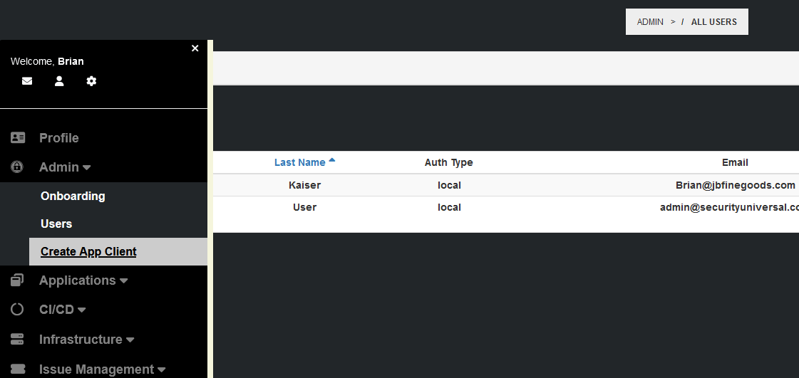
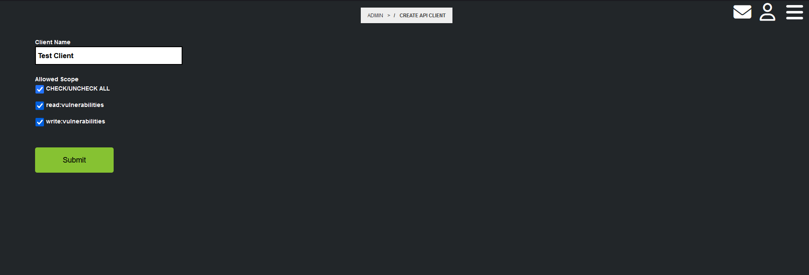
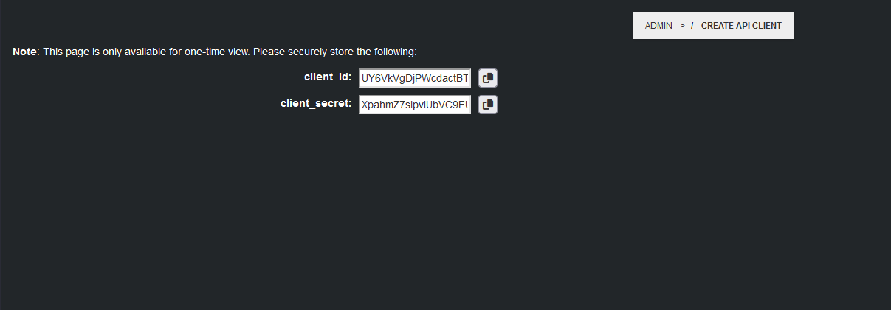

# Creating an API Client

For more information please refer to our [Official Rest API Documenation](https://www.securityuniversal.com/secusphere/api/documentation)

In order to submit CI/CD Pipeline Security Assessment Reports to SecuSphere for analysis, an OAuth2 API Client is required.

To manage SecuSphere API Clients, you must have a user with Administrator privileges.

To reach the Create API Client page, activate the side menu and then click on Admin > Create API Client.



From the `Create API Client` page, add a client name and select your perferred permissions.


After clicking on the `Submit` button, you will be presented with the API Client ID and Secret.  Please note, this data is only available during this session and should be stored in a secure password manager.


### Sample API Client Apps

#### Python 
```python
import requests


OAUTH_SCOPES = ['read:vulnerabilities', 'write:vulnerabilities']


class ApiClient(object):
    def __init__(self, client_id, client_secret, vulnmanagerurl):
        self.vulnmanagerurl = vulnmanagerurl
        self.client_id = client_id
        self.client_secret = client_secret
        self.api_key = self.get_access_token()
        self.request_headers = {"Authorization": f"Bearer {self.api_key}"}

    def get_access_token(self):
        url = f'{self.vulnmanagerurl}/oauth/token'
        headers = {"Content-Type": "application/x-www-form-urlencoded"}
        data = {
            "grant_type": "client_credentials",
            "client_id": self.client_id,
            "client_secret": self.client_secret,
            "scope": " ".join(OAUTH_SCOPES)
        }
        response = requests.post(url, headers=headers, data=data)
        resp = response.json()
        return resp['access_token']
    
    def send_get(self, endpoint):
        url = f'{self.vulnmanagerurl}/{endpoint}'
        response = requests.get(url, headers=self.request_headers)
        resp = response.json()
        return resp

    def send_search(self, endpoint, field, value):
        url = f'{self.vulnmanagerurl}/{endpoint}'
        if ':' in field:
            fields = field.split(':')
            values = value.split(':')
            data = {}
            index = 0
            for i in fields:
                data[i] = values[index]
                index +=1
        else:
            data = {
                field: value,
            }
        response = requests.post(url, headers=self.request_headers, json=data)
        resp = response.json()
        return resp

    def send_post(self, endpoint, data):
        url = f'{self.vulnmanagerurl}/{endpoint}'
        response = requests.post(url, headers=self.request_headers, json=data)
        resp = response.json()
        return resp
```

**Usage**
```python
client_id = 'paste client_id here'
client_secret = 'paste client_secret here'
vulnmanagerurl = 'https://secusphere.acme.com'

api = ApiClient(client_id, client_secret, vulnmanagerurl)

## Get a list of all vulnerabilities ##
resp = api.send_get('all_vulnerabilities')

## Add new vulnerabilities (list) ##
data = [{
  "VulnerabilityName": "This is vulnerability one",
  "CVEID": "CVE-123",
  "CWEID": "CWE-45",
  "Description": "Don't worry, this is just a test!",
  "ReleaseDate": "2022-11-07",
  "Severity": "High",
  "Classification": "Secret",
  "Source": "Trufflehog-CI/CD",
  "LastModifiedDate": "2022-11-07",
  "ReferenceName": "None",
  "ReferenceUrl": "None",
  "ReferenceTags": "None",
  "AddDate": "2022-11-08"
}]
resp = api.send_post('add_vulnerabilities', data)

## Search vulnerabilities ##
field = "Severity"
value = "High"

resp = api.send_search('search_vulnerabilities', field, value)


```

#### JavaScript 
```javascript
const axios = require('axios');

const OAUTH_SCOPES = ['read:vulnerabilities', 'write:vulnerabilities'];

class ApiClient {
    constructor(client_id, client_secret, vulnmanagerurl) {
        this.vulnmanagerurl = vulnmanagerurl;
        this.client_id = client_id;
        this.client_secret = client_secret;
        this.get_access_token().then((token) => {
            this.api_key = token;
            this.request_headers = {"Authorization": `Bearer ${this.api_key}`};
        });
    }

    async get_access_token() {
        const url = `${this.vulnmanagerurl}/oauth/token`;
        const headers = {"Content-Type": "application/x-www-form-urlencoded"};
        const data = {
            grant_type: "client_credentials",
            client_id: this.client_id,
            client_secret: this.client_secret,
            scope: OAUTH_SCOPES.join(' ')
        };
        const response = await axios.post(url, data, {headers: headers});
        return response.data.access_token;
    }

    async send_get(endpoint) {
        const url = `${this.vulnmanagerurl}/${endpoint}`;
        const response = await axios.get(url, {headers: this.request_headers});
        return response.data;
    }

    async send_search(endpoint, field, value) {
        const url = `${this.vulnmanagerurl}/${endpoint}`;
        let data = {};
        if (field.includes(':')) {
            const fields = field.split(':');
            const values = value.split(':');
            for (let i = 0; i < fields.length; i++) {
                data[fields[i]] = values[i];
            }
        } else {
            data = {
                [field]: value
            };
        }
        const response = await axios.post(url, data, {headers: this.request_headers});
        return response.data;
    }

    async send_post(endpoint, data) {
        const url = `${this.vulnmanagerurl}/${endpoint}`;
        const response = await axios.post(url, data, {headers: this.request_headers});
        return response.data;
    }
}
```
**Usage**
```javascript
const client_id = 'paste client_id here';
const client_secret = 'paste client_secret here';
const vulnmanagerurl = 'https://secusphere.acme.com';

const api = new ApiClient(client_id, client_secret, vulnmanagerurl);

// Get a list of all vulnerabilities
api.send_get('all_vulnerabilities').then((resp) => console.log(resp));

// Add new vulnerabilities
const data = [{
  "VulnerabilityName": "This is vulnerability one",
  "CVEID": "CVE-123",
  "CWEID": "CWE-45",
  "Description": "Don't worry, this is just a test!",
  "ReleaseDate": "2022-11-07",
  "Severity": "High",
  "Classification": "Secret",
  "Source": "Trufflehog-CI/CD",
  "LastModifiedDate": "2022-11-07",
  "ReferenceName": "None",
  "ReferenceUrl": "None",
  "ReferenceTags": "None",
  "AddDate": "2022-11-08"
}];
api.send_post('add_vulnerabilities', data).then((resp) => console.log(resp));

// Search vulnerabilities
const field = "Severity";
const value = "High";
api.send_search('search_vulnerabilities', field, value).then((resp) => console.log(resp));
```

#### Java 
```java
import java.net.URI;
import java.net.http.HttpClient;
import java.net.http.HttpRequest;
import java.net.http.HttpResponse;
import java.net.http.HttpHeaders;
import java.util.*;

import com.google.gson.Gson; 

public class ApiClient {
    private String vulnmanagerurl;
    private String client_id;
    private String client_secret;
    private String api_key;
    private Map<String, String> request_headers = new HashMap<>();

    public ApiClient(String client_id, String client_secret, String vulnmanagerurl) throws Exception {
        this.vulnmanagerurl = vulnmanagerurl;
        this.client_id = client_id;
        this.client_secret = client_secret;
        this.api_key = this.get_access_token();
        this.request_headers.put("Authorization", "Bearer " + this.api_key);
    }

    public String get_access_token() throws Exception {
        String url = this.vulnmanagerurl + "/oauth/token";
        Map<String, String> data = new HashMap<>();
        data.put("grant_type", "client_credentials");
        data.put("client_id", this.client_id);
        data.put("client_secret", this.client_secret);
        data.put("scope", String.join(" ", Arrays.asList("read:vulnerabilities", "write:vulnerabilities")));

        HttpClient client = HttpClient.newHttpClient();
        HttpRequest request = HttpRequest.newBuilder()
                .uri(new URI(url))
                .headers("Content-Type", "application/x-www-form-urlencoded")
                .POST(HttpRequest.BodyPublishers.ofString(new Gson().toJson(data)))
                .build();

        HttpResponse<String> response = client.send(request, HttpResponse.BodyHandlers.ofString());
        Map resp = new Gson().fromJson(response.body(), Map.class);
        return (String) resp.get("access_token");
    }

    public Map send_get(String endpoint) throws Exception {
        String url = this.vulnmanagerurl + "/" + endpoint;
        HttpClient client = HttpClient.newHttpClient();
        HttpRequest request = HttpRequest.newBuilder()
                .uri(new URI(url))
                .headers("Authorization", "Bearer " + this.api_key)
                .GET()
                .build();

        HttpResponse<String> response = client.send(request, HttpResponse.BodyHandlers.ofString());
        return new Gson().fromJson(response.body(), Map.class);
    }

    public Map send_search(String endpoint, String field, String value) throws Exception {
        String url = this.vulnmanagerurl + "/" + endpoint;
        Map<String, String> data = new HashMap<>();
        if (field.contains(":")) {
            String[] fields = field.split(":");
            String[] values = value.split(":");
            for (int i = 0; i < fields.length; i++) {
                data.put(fields[i], values[i]);
            }
        } else {
            data.put(field, value);
        }

        HttpClient client = HttpClient.newHttpClient();
        HttpRequest request = HttpRequest.newBuilder()
                .uri(new URI(url))
                .headers("Authorization", "Bearer " + this.api_key)
                .POST(HttpRequest.BodyPublishers.ofString(new Gson().toJson(data)))
                .build();

        HttpResponse<String> response = client.send(request, HttpResponse.BodyHandlers.ofString());
        return new Gson().fromJson(response.body(), Map.class);
    }

    public Map send_post(String endpoint, Map data) throws Exception {
        String url = this.vulnmanagerurl + "/" + endpoint;
        HttpClient client = HttpClient.newHttpClient();
        HttpRequest request = HttpRequest.newBuilder()
                .uri(new URI(url))
                .headers("Authorization", "Bearer " + this.api_key)
                .POST(HttpRequest.BodyPublishers.ofString(new Gson().toJson(data)))
                .build();

        HttpResponse<String> response = client.send(request, HttpResponse.BodyHandlers.ofString());
        return new Gson().fromJson(response.body(), Map.class);
    }
}
```
**Usage**
```java
String client_id = "paste client_id here";
String client_secret = "paste client_secret here";
String vulnmanagerurl = "https://secusphere.acme.com";

ApiClient api = new ApiClient(client_id, client_secret, vulnmanagerurl);

// Get a list of all vulnerabilities
Map resp = api.send_get("all_vulnerabilities");

// Add new vulnerabilities
Map<String, Object> data = new HashMap<>();
data.put("VulnerabilityName", "This is vulnerability one");
data.put("CVEID", "CVE-123");
data.put("CWEID", "CWE-45");
data.put("Description", "Don't worry, this is just a test!");
data.put("ReleaseDate", "2022-11-07");
data.put("Severity", "High");
data.put("Classification", "Secret");
data.put("Source", "Trufflehog-CI/CD");
data.put("LastModifiedDate", "2022-11-07");
data.put("ReferenceName", "None");
data.put("ReferenceUrl", "None");
data.put("ReferenceTags", "None");
data.put("AddDate", "2022-11-08");

resp = api.send_post("add_vulnerabilities", data);

// Search vulnerabilities
String field = "Severity";
String value = "High";

resp = api.send_search("search_vulnerabilities", field, value);

```

#### C# 
```csharp
using System;
using System.Net.Http;
using System.Threading.Tasks;
using System.Collections.Generic;
using Newtonsoft.Json;

public class ApiClient
{
    private static readonly string[] OAUTH_SCOPES = { "read:vulnerabilities", "write:vulnerabilities" };
    private string vulnmanagerurl;
    private string client_id;
    private string client_secret;
    private string api_key;
    private Dictionary<string, string> request_headers = new Dictionary<string, string>();

    public ApiClient(string client_id, string client_secret, string vulnmanagerurl)
    {
        this.vulnmanagerurl = vulnmanagerurl;
        this.client_id = client_id;
        this.client_secret = client_secret;
        this.api_key = GetAccessToken().Result;
        this.request_headers.Add("Authorization", $"Bearer {this.api_key}");
    }

    private async Task<string> GetAccessToken()
    {
        string url = $"{this.vulnmanagerurl}/oauth/token";
        var values = new Dictionary<string, string>
        {
            { "grant_type", "client_credentials" },
            { "client_id", this.client_id },
            { "client_secret", this.client_secret },
            { "scope", string.Join(" ", OAUTH_SCOPES) }
        };

        HttpClient client = new HttpClient();
        client.DefaultRequestHeaders.TryAddWithoutValidation("Content-Type", "application/x-www-form-urlencoded");
        HttpResponseMessage response = await client.PostAsync(url, new FormUrlEncodedContent(values));
        string json = await response.Content.ReadAsStringAsync();
        var token = JsonConvert.DeserializeObject<Dictionary<string, string>>(json);
        return token["access_token"];
    }

    public async Task<Dictionary<string, object>> SendGet(string endpoint)
    {
        string url = $"{this.vulnmanagerurl}/{endpoint}";
        HttpClient client = new HttpClient();
        client.DefaultRequestHeaders.Clear();
        foreach (var header in request_headers)
        {
            client.DefaultRequestHeaders.Add(header.Key, header.Value);
        }
        var response = await client.GetStringAsync(url);
        return JsonConvert.DeserializeObject<Dictionary<string, object>>(response);
    }

    public async Task<Dictionary<string, object>> SendSearch(string endpoint, string field, string value)
    {
        string url = $"{this.vulnmanagerurl}/{endpoint}";
        Dictionary<string, string> data = new Dictionary<string, string>();
        if (field.Contains(":"))
        {
            string[] fields = field.Split(':');
            string[] values = value.Split(':');
            for (int i = 0; i < fields.Length; i++)
            {
                data.Add(fields[i], values[i]);
            }
        }
        else
        {
            data.Add(field, value);
        }

        HttpClient client = new HttpClient();
        client.DefaultRequestHeaders.Clear();
        foreach (var header in request_headers)
        {
            client.DefaultRequestHeaders.Add(header.Key, header.Value);
        }
        var response = await client.PostAsync(url, new StringContent(JsonConvert.SerializeObject(data)));
        var jsonString = await response.Content.ReadAsStringAsync();
        return JsonConvert.DeserializeObject<Dictionary<string, object>>(jsonString);
    }

    public async Task<Dictionary<string, object>> SendPost(string endpoint, Dictionary<string, string> data)
    {
        string url = $"{this.vulnmanagerurl}/{endpoint}";
        HttpClient client = new HttpClient();
        client.DefaultRequestHeaders.Clear();
        foreach (var header in request_headers)
        {
            client.DefaultRequestHeaders.Add(header.Key, header.Value);
        }
        var response = await client.PostAsync(url, new StringContent(JsonConvert.SerializeObject(data)));
        var jsonString = await response.Content.ReadAsStringAsync();
        return JsonConvert.DeserializeObject<Dictionary<string, object>>(jsonString);
    }
}
```
**Usage**
```csharp
string client_id = "paste client_id here";
string client_secret = "paste client_secret here";
string vulnmanagerurl = "https://secusphere.acme.com";

ApiClient api = new ApiClient(client_id, client_secret, vulnmanagerurl);

// Get a list of all vulnerabilities
Task<Dictionary<string, object>> resp = api.SendGet("all_vulnerabilities");

// Add new vulnerabilities
Dictionary<string, string> data = new Dictionary<string, string>
{
    {"VulnerabilityName", "This is vulnerability one"},
    {"CVEID", "CVE-123"},
    {"CWEID", "CWE-45"},
    {"Description", "Don't worry, this is just a test!"},
    {"ReleaseDate", "2022-11-07"},
    {"Severity", "High"},
    {"Classification", "Secret"},
    {"Source", "Trufflehog-CI/CD"},
    {"LastModifiedDate", "2022-11-07"},
    {"ReferenceName", "None"},
    {"ReferenceUrl", "None"},
    {"ReferenceTags", "None"},
    {"AddDate", "2022-11-08"}
};

resp = api.SendPost("add_vulnerabilities", data);

// Search vulnerabilities
string field = "Severity";
string value = "High";

resp = api.SendSearch("search_vulnerabilities", field, value);
```

#### PHP 
```php
<?php
class ApiClient {
    const OAUTH_SCOPES = ['read:vulnerabilities', 'write:vulnerabilities'];

    private $vulnmanagerurl;
    private $client_id;
    private $client_secret;
    private $api_key;
    private $request_headers = [];

    public function __construct($client_id, $client_secret, $vulnmanagerurl) {
        $this->vulnmanagerurl = $vulnmanagerurl;
        $this->client_id = $client_id;
        $this->client_secret = $client_secret;
        $this->api_key = $this->get_access_token();
        $this->request_headers = ["Authorization: Bearer {$this->api_key}"];
    }

    private function get_access_token() {
        $url = "{$this->vulnmanagerurl}/oauth/token";
        $headers = ["Content-Type: application/x-www-form-urlencoded"];
        $data = [
            "grant_type" => "client_credentials",
            "client_id" => $this->client_id,
            "client_secret" => $this->client_secret,
            "scope" => implode(" ", self::OAUTH_SCOPES)
        ];
        $options = [
            'http' => [
                'header'  => $headers,
                'method'  => 'POST',
                'content' => http_build_query($data)
            ]
        ];
        $context  = stream_context_create($options);
        $response = file_get_contents($url, false, $context);
        $resp = json_decode($response, true);
        return $resp['access_token'];
    }

    public function send_get($endpoint) {
        $url = "{$this->vulnmanagerurl}/{$endpoint}";
        $options = [
            'http' => [
                'header'  => $this->request_headers,
                'method'  => 'GET'
            ]
        ];
        $context  = stream_context_create($options);
        $response = file_get_contents($url, false, $context);
        return json_decode($response, true);
    }

    public function send_search($endpoint, $field, $value) {
        $url = "{$this->vulnmanagerurl}/{$endpoint}";
        $data = [];
        if (strpos($field, ':') !== false) {
            $fields = explode(':', $field);
            $values = explode(':', $value);
            for ($i = 0; $i < count($fields); $i++) {
                $data[$fields[$i]] = $values[$i];
            }
        } else {
            $data[$field] = $value;
        }
        $options = [
            'http' => [
                'header'  => $this->request_headers,
                'method'  => 'POST',
                'content' => json_encode($data)
            ]
        ];
        $context  = stream_context_create($options);
        $response = file_get_contents($url, false, $context);
        return json_decode($response, true);
    }

    public function send_post($endpoint, $data) {
        $url = "{$this->vulnmanagerurl}/{$endpoint}";
        $options = [
            'http' => [
                'header'  => $this->request_headers,
                'method'  => 'POST',
                'content' => json_encode($data)
            ]
        ];
        $context  = stream_context_create($options);
        $response = file_get_contents($url, false, $context);
        return json_decode($response, true);
    }
}
```
**Usage**
```php
$client_id = 'paste client_id here';
$client_secret = 'paste client_secret here';
$vulnmanagerurl = 'https://secusphere.acme.com';

$api = new ApiClient($client_id, $client_secret, $vulnmanagerurl);

// Get a list of all vulnerabilities
$resp = $api->send_get('all_vulnerabilities');

// Add new vulnerabilities (list)
$data = [[
    "VulnerabilityName" => "This is vulnerability one",
    "CVEID" => "CVE-123",
    "CWEID" => "CWE-45",
    "Description" => "Don't worry, this is just a test!",
    "ReleaseDate" => "2022-11-07",
    "Severity" => "High",
    "Classification" => "Secret",
    "Source" => "Trufflehog-CI/CD",
    "LastModifiedDate" => "2022-11-07",
    "ReferenceName" => "None",
    "ReferenceUrl" => "None",
    "ReferenceTags" => "None",
    "AddDate" => "2022-11-08"
]];
$resp = $api->send_post('add_vulnerabilities', $data);

// Search vulnerabilities
$field = "Severity";
$value = "High";

$resp = $api->send_search('search_vulnerabilities', $field, $value);
?>
```

#### Ruby
```ruby
require 'rest-client'
require 'json'

OAUTH_SCOPES = ['read:vulnerabilities', 'write:vulnerabilities']

class ApiClient
  def initialize(client_id, client_secret, vulnmanagerurl)
    @vulnmanagerurl = vulnmanagerurl
    @client_id = client_id
    @client_secret = client_secret
    @api_key = get_access_token
    @request_headers = {"Authorization" => "Bearer #{@api_key}"}
  end

  def get_access_token
    url = "#{@vulnmanagerurl}/oauth/token"
    headers = {"Content-Type" => "application/x-www-form-urlencoded"}
    data = {
      "grant_type" => "client_credentials",
      "client_id" => @client_id,
      "client_secret" => @client_secret,
      "scope" => OAUTH_SCOPES.join(' ')
    }
    response = RestClient.post(url, data, headers)
    resp = JSON.parse(response.body)
    return resp['access_token']
  end

  def send_get(endpoint)
    url = "#{@vulnmanagerurl}/#{endpoint}"
    response = RestClient.get(url, @request_headers)
    resp = JSON.parse(response.body)
    return resp
  end

  def send_search(endpoint, field, value)
    url = "#{@vulnmanagerurl}/#{endpoint}"
    data = {}
    if field.include? ':'
      fields = field.split(':')
      values = value.split(':')
      fields.each_with_index do |f, i|
        data[f] = values[i]
      end
    else
      data[field] = value
    end
    response = RestClient.post(url, data.to_json, @request_headers.merge({"Content-Type" => "application/json"}))
    resp = JSON.parse(response.body)
    return resp
  end

  def send_post(endpoint, data)
    url = "#{@vulnmanagerurl}/#{endpoint}"
    response = RestClient.post(url, data.to_json, @request_headers.merge({"Content-Type" => "application/json"}))
    resp = JSON.parse(response.body)
    return resp
  end
end
```
**Usage**
```ruby
client_id = 'paste client_id here'
client_secret = 'paste client_secret here'
vulnmanagerurl = 'https://secusphere.acme.com'

api = ApiClient.new(client_id, client_secret, vulnmanagerurl)

# Get a list of all vulnerabilities
resp = api.send_get('all_vulnerabilities')

# Add new vulnerabilities (list)
data = [{
  "VulnerabilityName" => "This is vulnerability one",
  "CVEID" => "CVE-123",
  "CWEID" => "CWE-45",
  "Description" => "Don't worry, this is just a test!",
  "ReleaseDate" => "2022-11-07",
  "Severity" => "High",
  "Classification" => "Secret",
  "Source" => "Trufflehog-CI/CD",
  "LastModifiedDate" => "2022-11-07",
  "ReferenceName" => "None",
  "ReferenceUrl" => "None",
  "ReferenceTags" => "None",
  "AddDate" => "2022-11-08"
}]
resp = api.send_post('add_vulnerabilities', data)

# Search vulnerabilities
field = "Severity"
value = "High"

resp = api.send_search('search_vulnerabilities', field, value)
```

#### Go 
```go
package main

import (
	"bytes"
	"encoding/json"
	"fmt"
	"io/ioutil"
	"net/http"
	"net/url"
	"strings"
)

var OAUTH_SCOPES = []string{"read:vulnerabilities", "write:vulnerabilities"}

type ApiClient struct {
	vulnmanagerurl  string
	client_id       string
	client_secret   string
	api_key         string
	request_headers map[string]string
}

func NewApiClient(client_id string, client_secret string, vulnmanagerurl string) *ApiClient {
	client := &ApiClient{client_id: client_id, client_secret: client_secret, vulnmanagerurl: vulnmanagerurl}
	client.api_key = client.get_access_token()
	client.request_headers = map[string]string{"Authorization": "Bearer " + client.api_key}
	return client
}

func (client *ApiClient) get_access_token() string {
	data := url.Values{}
	data.Set("grant_type", "client_credentials")
	data.Set("client_id", client.client_id)
	data.Set("client_secret", client.client_secret)
	data.Set("scope", strings.Join(OAUTH_SCOPES, " "))

	resp, err := http.PostForm(client.vulnmanagerurl+"/oauth/token", data)

	if err != nil {
		panic(err)
	}

	defer resp.Body.Close()

	var result map[string]interface{}

	json.NewDecoder(resp.Body).Decode(&result)

	return result["access_token"].(string)
}

func (client *ApiClient) send_get(endpoint string) map[string]interface{} {
	req, err := http.NewRequest("GET", client.vulnmanagerurl+"/"+endpoint, nil)
	if err != nil {
		panic(err)
	}

	req.Header.Add("Authorization", "Bearer "+client.api_key)

	resp, err := http.DefaultClient.Do(req)
	if err != nil {
		panic(err)
	}

	defer resp.Body.Close()

	var result map[string]interface{}

	json.NewDecoder(resp.Body).Decode(&result)

	return result
}

func (client *ApiClient) send_search(endpoint string, field string, value string) map[string]interface{} {
	url := client.vulnmanagerurl + "/" + endpoint
	data := make(map[string]interface{})
	fields := strings.Split(field, ":")
	values := strings.Split(value, ":")

	for i, f := range fields {
		data[f] = values[i]
	}

	dataJson, _ := json.Marshal(data)
	resp, err := http.Post(url, "application/json", bytes.NewBuffer(dataJson))

	if err != nil {
		panic(err)
	}

	defer resp.Body.Close()

	var result map[string]interface{}

	json.NewDecoder(resp.Body).Decode(&result)

	return result
}

func (client *ApiClient) send_post(endpoint string, data map[string]interface{}) map[string]interface{} {
	dataJson, _ := json.Marshal(data)
	resp, err := http.Post(client.vulnmanagerurl+"/"+endpoint, "application/json", bytes.NewBuffer(dataJson))

	if err != nil {
		panic(err)
	}

	defer resp.Body.Close()

	var result map[string]interface{}

	json.NewDecoder(resp.Body).Decode(&result)

	return result
}

func main() {
	client_id := "paste client_id here"
	client_secret := "paste client_secret here"
	vulnmanagerurl := "https://secusphere.acme.com"

	api := NewApiClient(client_id, client_secret, vulnmanagerurl)

	resp := api.send_get("all_vulnerabilities")
	fmt.Println(resp)

	data := map[string]interface{}{
		"VulnerabilityName": "This is vulnerability one",
		"CVEID":             "CVE-123",
		"CWEID":             "CWE-45",
		"Description":       "Don't worry, this is just a test!",
		"ReleaseDate":       "2022-11-07",
		"Severity":          "High",
		"Classification":    "Secret",
		"Source":            "Trufflehog-CI/CD",
		"LastModifiedDate":  "2022-11-07",
		"ReferenceName":     "None",
		"ReferenceUrl":      "None",
		"ReferenceTags":     "None",
		"AddDate":           "2022-11-08",
	}

	resp = api.send_post("add_vulnerabilities", data)
	fmt.Println(resp)

	field := "Severity"
	value := "High"

	resp = api.send_search("search_vulnerabilities", field, value)
	fmt.Println(resp)
}
```


#### TypeScript
```typescript
import axios from 'axios';

const OAUTH_SCOPES = ['read:vulnerabilities', 'write:vulnerabilities'];

class ApiClient {
  private vulnmanagerurl: string;
  private client_id: string;
  private client_secret: string;
  private api_key: string;
  private request_headers: any;

  constructor(client_id: string, client_secret: string, vulnmanagerurl: string) {
    this.vulnmanagerurl = vulnmanagerurl;
    this.client_id = client_id;
    this.client_secret = client_secret;
    this.api_key = this.get_access_token();
    this.request_headers = {"Authorization": `Bearer ${this.api_key}`};
  }

  private async get_access_token() {
    const url = `${this.vulnmanagerurl}/oauth/token`;
    const headers = {"Content-Type": "application/x-www-form-urlencoded"};
    const data = {
      grant_type: "client_credentials",
      client_id: this.client_id,
      client_secret: this.client_secret,
      scope: OAUTH_SCOPES.join(' '),
    };
    const response = await axios.post(url, data, {headers});
    return response.data.access_token;
  }

  public async send_get(endpoint: string) {
    const url = `${this.vulnmanagerurl}/${endpoint}`;
    const response = await axios.get(url, {headers: this.request_headers});
    return response.data;
  }

  public async send_search(endpoint: string, field: string, value: string) {
    const url = `${this.vulnmanagerurl}/${endpoint}`;
    let data: any = {};

    if (field.includes(':')) {
      const fields = field.split(':');
      const values = value.split(':');

      fields.forEach((item, index) => {
        data[item] = values[index];
      });
    } else {
      data = {[field]: value};
    }

    const response = await axios.post(url, data, {headers: this.request_headers});
    return response.data;
  }

  public async send_post(endpoint: string, data: any) {
    const url = `${this.vulnmanagerurl}/${endpoint}`;
    const response = await axios.post(url, data, {headers: this.request_headers});
    return response.data;
  }
}
```
**Usage**
```typescript
const client_id = 'paste client_id here';
const client_secret = 'paste client_secret here';
const vulnmanagerurl = 'https://secusphere.acme.com';

const api = new ApiClient(client_id, client_secret, vulnmanagerurl);

// Get a list of all vulnerabilities
api.send_get('all_vulnerabilities').then(resp => console.log(resp));

// Add new vulnerabilities (list)
const data = [{
  "VulnerabilityName": "This is vulnerability one",
  "CVEID": "CVE-123",
  "CWEID": "CWE-45",
  "Description": "Don't worry, this is just a test!",
  "ReleaseDate": "2022-11-07",
  "Severity": "High",
  "Classification": "Secret",
  "Source": "Trufflehog-CI/CD",
  "LastModifiedDate": "2022-11-07",
  "ReferenceName": "None",
  "ReferenceUrl": "None",
  "ReferenceTags": "None",
  "AddDate": "2022-11-08",
}];

api.send_post('add_vulnerabilities', data).then(resp => console.log(resp));

// Search vulnerabilities
const field = "Severity";
const value = "High";

api.send_search('search_vulnerabilities', field, value).then(resp => console.log(resp));
```

#### Swift
```swift
import Foundation

let OAUTH_SCOPES = ["read:vulnerabilities", "write:vulnerabilities"]

class ApiClient {
    var vulnmanagerurl: String
    var client_id: String
    var client_secret: String
    var api_key: String
    var request_headers: [String: String]

    init(client_id: String, client_secret: String, vulnmanagerurl: String) {
        self.vulnmanagerurl = vulnmanagerurl
        self.client_id = client_id
        self.client_secret = client_secret
        self.api_key = ""
        self.request_headers = [:]

        self.api_key = self.get_access_token()
        self.request_headers = ["Authorization": "Bearer \(self.api_key)"]
    }

    func get_access_token() -> String {
        let semaphore = DispatchSemaphore(value: 0)
        var token = ""

        let url = URL(string: "\(self.vulnmanagerurl)/oauth/token")!
        var request = URLRequest(url: url)
        request.httpMethod = "POST"
        request.setValue("application/x-www-form-urlencoded", forHTTPHeaderField: "Content-Type")

        let data = [
            "grant_type": "client_credentials",
            "client_id": self.client_id,
            "client_secret": self.client_secret,
            "scope": OAUTH_SCOPES.joined(separator: " ")
        ]

        request.httpBody = data.map { "\($0)=\($1)" }.joined(separator: "&").data(using: .utf8)

        URLSession.shared.dataTask(with: request) { (data, response, error) in
            if let data = data {
                let json = try! JSONSerialization.jsonObject(with: data, options: []) as! [String: Any]
                token = json["access_token"] as! String
                semaphore.signal()
            }
        }.resume()

        semaphore.wait()
        return token
    }

    func send_get(endpoint: String) -> [String: Any]? {
        let semaphore = DispatchSemaphore(value: 0)
        var result: [String: Any]? = nil

        let url = URL(string: "\(self.vulnmanagerurl)/\(endpoint)")!
        var request = URLRequest(url: url)
        request.httpMethod = "GET"
        request.allHTTPHeaderFields = self.request_headers

        URLSession.shared.dataTask(with: request) { (data, response, error) in
            if let data = data {
                result = try! JSONSerialization.jsonObject(with: data, options: []) as? [String: Any]
                semaphore.signal()
            }
        }.resume()

        semaphore.wait()
        return result
    }

    func send_search(endpoint: String, field: String, value: String) -> [String: Any]? {
        let semaphore = DispatchSemaphore(value: 0)
        var result: [String: Any]? = nil

        let url = URL(string: "\(self.vulnmanagerurl)/\(endpoint)")!
        var request = URLRequest(url: url)
        request.httpMethod = "POST"
        request.allHTTPHeaderFields = self.request_headers
        request.setValue("application/json", forHTTPHeaderField: "Content-Type")

        var data = [String: String]()
        if field.contains(":") {
            let fields = field.split(separator: ":")
            let values = value.split(separator: ":")
            for (index, field) in fields.enumerated() {
                data[String(field)] = String(values[index])
            }
        } else {
            data[field] = value
        }

        request.httpBody = try! JSONSerialization.data(withJSONObject: data, options: [])

        URLSession.shared.dataTask(with: request) { (data, response, error) in
            if let data = data {
                result = try! JSONSerialization.jsonObject(with: data, options: []) as? [String: Any]
                semaphore.signal()
            }
        }.resume()

        semaphore.wait()
        return result
    }

    func send_post(endpoint: String, data: [String: Any]) -> [String: Any]? {
        let semaphore = DispatchSemaphore(value: 0)
        var result: [String: Any]? = nil

        let url = URL(string: "\(self.vulnmanagerurl)/\(endpoint)")!
        var request = URLRequest(url: url)
        request.httpMethod = "POST"
        request.allHTTPHeaderFields = self.request_headers
        request.setValue("application/json", forHTTPHeaderField: "Content-Type")

        request.httpBody = try! JSONSerialization.data(withJSONObject: data, options: [])

        URLSession.shared.dataTask(with: request) { (data, response, error) in
            if let data = data {
                result = try! JSONSerialization.jsonObject(with: data, options: []) as? [String: Any]
                semaphore.signal()
            }
        }.resume()

        semaphore.wait()
        return result
    }
}
```
**Usage**
```swift
let client_id = "paste client_id here"
let client_secret = "paste client_secret here"
let vulnmanagerurl = "https://secusphere.acme.com"

let api = ApiClient(client_id: client_id, client_secret: client_secret, vulnmanagerurl: vulnmanagerurl)

// Get a list of all vulnerabilities
if let resp = api.send_get(endpoint: "all_vulnerabilities") {
    print(resp)
}

// Add new vulnerabilities (list)
let data = [
    "VulnerabilityName": "This is vulnerability one",
    "CVEID": "CVE-123",
    "CWEID": "CWE-45",
    "Description": "Don't worry, this is just a test!",
    "ReleaseDate": "2022-11-07",
    "Severity": "High",
    "Classification": "Secret",
    "Source": "Trufflehog-CI/CD",
    "LastModifiedDate": "2022-11-07",
    "ReferenceName": "None",
    "ReferenceUrl": "None",
    "ReferenceTags": "None",
    "AddDate": "2022-11-08"
]

if let resp = api.send_post(endpoint: "add_vulnerabilities", data: data) {
    print(resp)
}

// Search vulnerabilities
let field = "Severity"
let value = "High"

if let resp = api.send_search(endpoint: "search_vulnerabilities", field: field, value: value) {
    print(resp)
}
```

#### Kotlin
```kotlin
import io.ktor.client.*
import io.ktor.client.features.json.*
import io.ktor.client.features.json.serializer.*
import io.ktor.client.request.*
import io.ktor.client.statement.*
import io.ktor.http.*

val OAUTH_SCOPES = listOf("read:vulnerabilities", "write:vulnerabilities")

class ApiClient(private val clientId: String, private val clientSecret: String, private val vulnManagerUrl: String) {
    private val client = HttpClient {
        install(JsonFeature) {
            serializer = KotlinxSerializer(kotlinx.serialization.json.Json {
                ignoreUnknownKeys = true
            })
        }
    }

    private val apiKey = getAccessToken()

    private suspend fun getAccessToken(): String {
        val url = "$vulnManagerUrl/oauth/token"
        val headers = mapOf("Content-Type" to ContentType.Application.FormUrlEncoded.toString())
        val data = mapOf(
            "grant_type" to "client_credentials",
            "client_id" to clientId,
            "client_secret" to clientSecret,
            "scope" to OAUTH_SCOPES.joinToString(" ")
        )

        val response: HttpResponse = client.post(url) {
            headers.forEach { key, value ->
                header(key, value)
            }
            body = data
        }

        val resp = response.receive<Map<String, Any>>()
        return resp["access_token"] as String
    }

    suspend fun sendGet(endpoint: String): Map<String, Any> {
        val url = "$vulnManagerUrl/$endpoint"
        val headers = mapOf("Authorization" to "Bearer $apiKey")

        val response: HttpResponse = client.get(url) {
            headers.forEach { key, value ->
                header(key, value)
            }
        }

        return response.receive()
    }

    suspend fun sendSearch(endpoint: String, field: String, value: String): Map<String, Any> {
        val url = "$vulnManagerUrl/$endpoint"
        val headers = mapOf("Authorization" to "Bearer $apiKey")

        val data = mutableMapOf<String, Any>()
        if (field.contains(":")) {
            val fields = field.split(":")
            val values = value.split(":")
            for (i in fields.indices) {
                data[fields[i]] = values[i]
            }
        } else {
            data[field] = value
        }

        val response: HttpResponse = client.post(url) {
            headers.forEach { key, value ->
                header(key, value)
            }
            contentType(ContentType.Application.Json)
            body = data
        }

        return response.receive()
    }

    suspend fun sendPost(endpoint: String, data: Map<String, Any>): Map<String, Any> {
        val url = "$vulnManagerUrl/$endpoint"
        val headers = mapOf("Authorization" to "Bearer $apiKey")

        val response: HttpResponse = client.post(url) {
            headers.forEach { key, value ->
                header(key, value)
            }
            contentType(ContentType.Application.Json)
            body = data
        }

        return response.receive()
    }
}
```
**Usage**
```kotlin
import kotlinx.coroutines.runBlocking

fun main() = runBlocking {
    val clientId = "paste client_id here"
    val clientSecret = "paste client_secret here"
    val vulnManagerUrl = "https://secusphere.acme.com"

    val api = ApiClient(clientId, clientSecret, vulnManagerUrl)

    // Get a list of all vulnerabilities
    val resp = api.sendGet("all_vulnerabilities")
    println(resp)

    // Add new vulnerabilities (list)
    val data = listOf(mapOf(
        "VulnerabilityName" to "This is vulnerability one",
        "CVEID" to "CVE-123",
        "CWEID" to "CWE-45",
        "Description" to "Don't worry, this is just a test!",
        "ReleaseDate" to "2022-11-07",
        "Severity" to "High",
        "Classification" to "Secret",
        "Source" to "Trufflehog-CI/CD",
        "LastModifiedDate" to "2022-11-07",
        "ReferenceName" to "None",
        "ReferenceUrl" to "None",
        "ReferenceTags" to "None",
        "AddDate" to "2022-11-08"
    ))

    val respPost = api.sendPost("add_vulnerabilities", data.first())
    println(respPost)

    // Search vulnerabilities
    val field = "Severity"
    val value = "High"

    val respSearch = api.sendSearch("search_vulnerabilities", field, value)
    println(respSearch)
}
```


