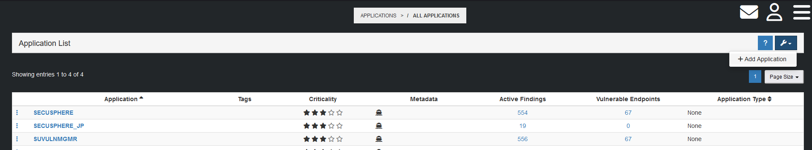
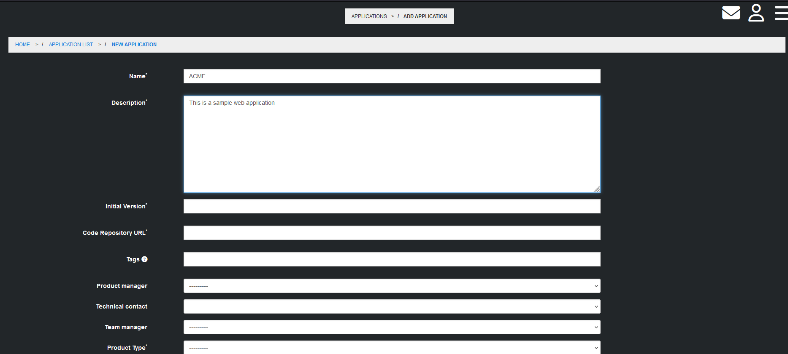
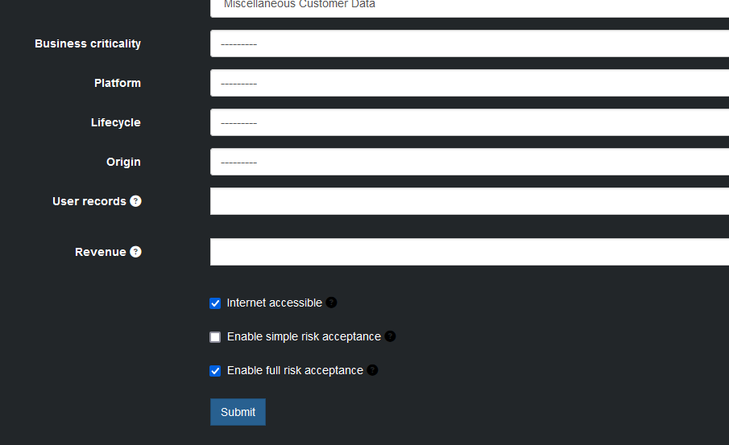

# Creating an Application Profile
[Back to User Guide](./index.md)

In SecuSphere, an Application Profile represents a unique instance of an Application that you'd like SecuSphere to monitor.

### Automatic Application Profile Creation

When using the Rest API or a CI/CD Pipeline Integration, SecuSphere will automatically create a unique Application Profile for each application.  If you plan on using the Rest API or CI/CD Pipeline Integrations, you can skip this Manual Application Profile Creation step as it is not necessary.

### Manual Application Profile Creation

To manually add a new Application profile, you must be a user with Administrator permissions.  To reach the Add Application page, either enter `https://[your-SecuSphere-instance]/add_application` or navigate in the console from the `all_applications` page.

From the `add_application` page, enter the specifics for your Application.

When finished, click the submit button at the bottom of the page.

[Back to the Top](#creating-an-application-profile)