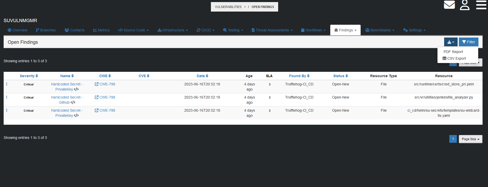

# Creating Reports
[Back to User Guide](./README.md)

## Application Report
To generate an Application Findings report, navigate to the Dashboard for the target Application.

Click on the blue report button to view the Report format options

Your new report will be downloaded and available to view.

[Back to the Top](#creating-reports)

## Application Findings Report
To generate an Application Findings report, navigate to any of the Open Findings tabs.

Click on the blue report button to view the Report format options

Your new report will be downloaded and available to view.

[Back to the Top](#creating-reports)
