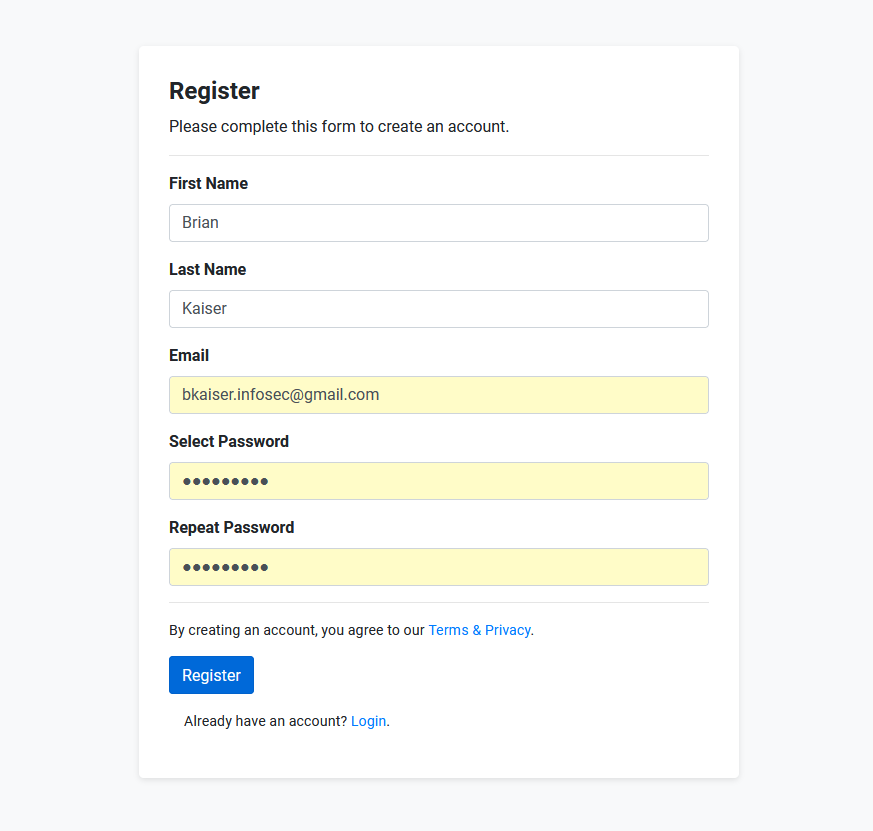

# Getting Started
[Back to User Guide](./index.md)

1. Open your web browser and navigate to the ThreatBuster URL 

  
2. Your browser will be redirected to the Register page. 

  
3. Add the required user information and the click on the Register button. 

  
4. Use your newly created user credentials to login to the web console. 

[Back to the Top](#getting-started)