# JIRA Integration Guide
[Back to User Guide](../index.md)

* [Adding a New Integration](#adding-a-new-integration)
* [Assigning Application Profiles to JIRA Projects](#assigning-application-profiles-to-jira-projects)
* [Creating JIRA Issues](#creating-jira-issues)

To add a JIRA integration, you must be a user with Administrator privileges.

## Adding a New Integration
Start by clicking on the Side Menu button, click on the `Integrations` tab and then click `Add Integration`.
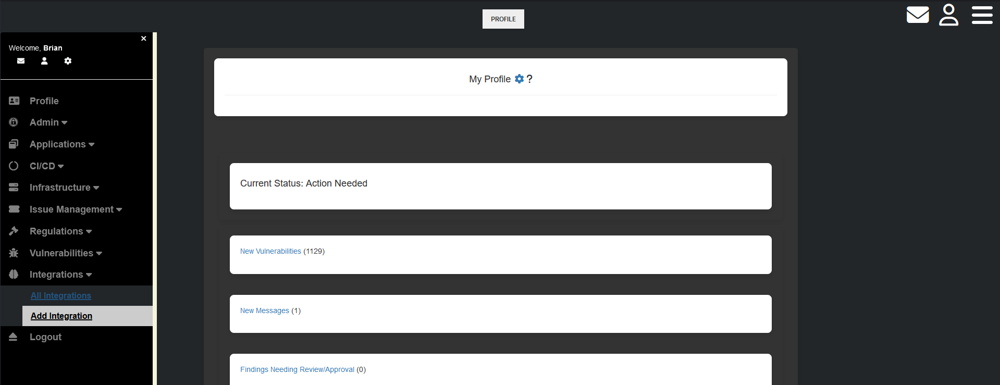

Within your JIRA Instance, create an API Key with the permissions to read all JIRA projects and assign Issues within each JIRA project.
Start by logging into your JIRA Instance and then navigate to [https://id.atlassian.com/manage-profile/security/api-tokens](https://id.atlassian.com/manage-profile/security/api-tokens).

Click on the `Create API token` button and then add a Label for the new API token.
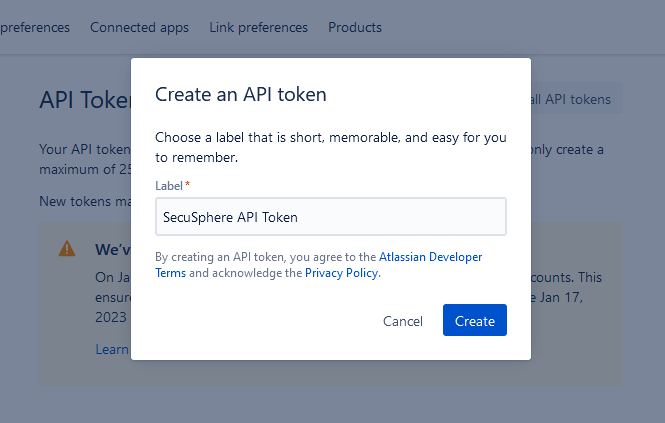

Copy the new API token value and store in a secure password manager.
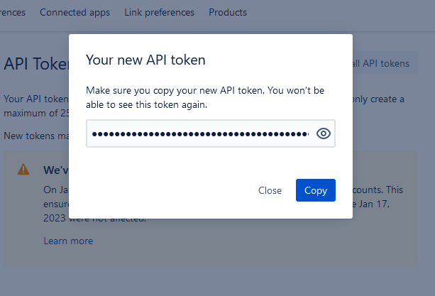

From the `Add Integration` page, add your JIRA instance details including your JIRA username and API Key.

When completed, click on the `Submit` button to add the new JIRA instance.
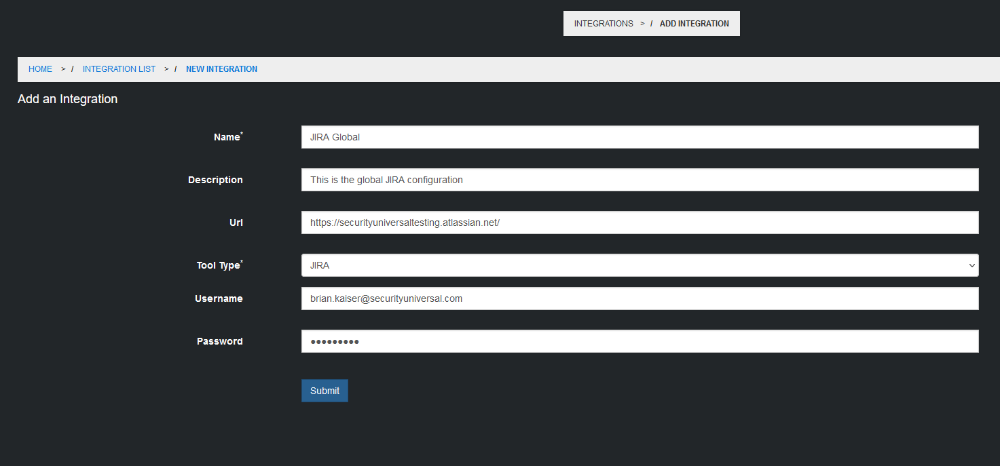

You new JIRA integration will now appear in the Integrations list.
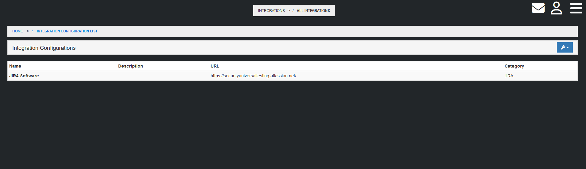

[Back to the Top](#jira-integration-guide)

## Assigning Application Profiles to JIRA Projects
Navigate to the Application list to select the target Application Profile
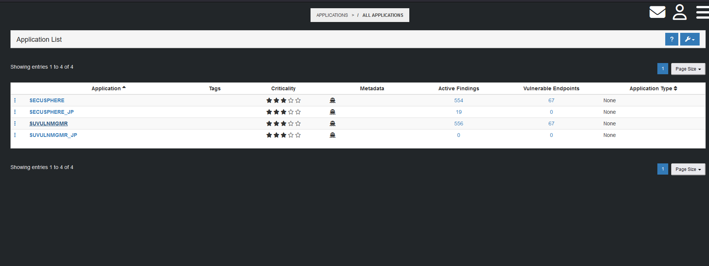

From the Application dashboard, click on the `Settings` tab, and then click on `Add Integration`
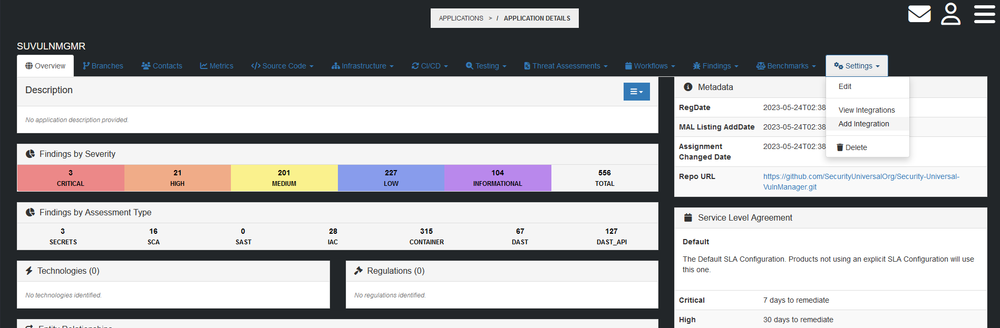

From the `New Integration` page, select the name of the Global JIRA Integration from the `Tool Type` dropdown
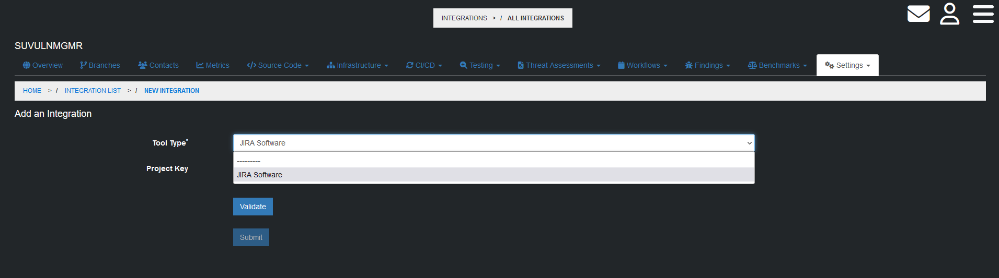

Next, add the JIRA Project key that will be assigned to this Application Profile and then click Validate to confirm settings.
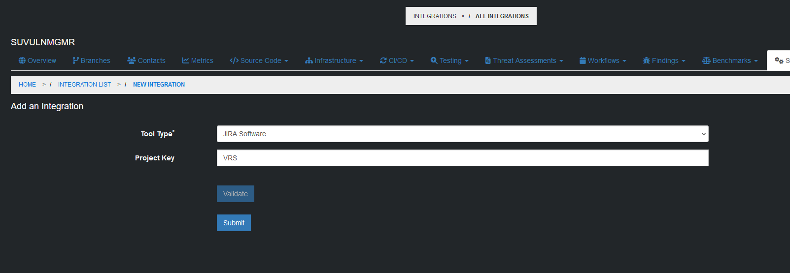

Click on the `Submit` button to save the JIRA configuration settings.  You will be redirected to the Application Integrations list where you can confirm the JIRA Project was correctly assigned.
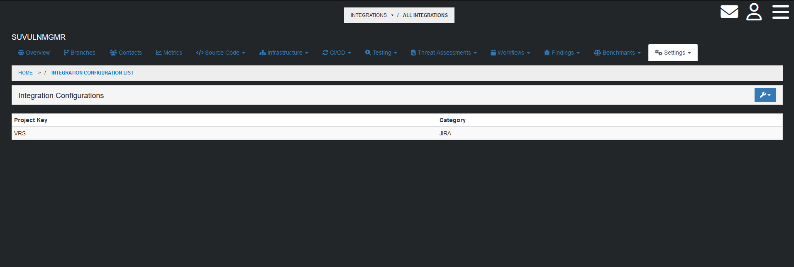

[Back to the Top](#jira-integration-guide)

## Creating JIRA Issues
Navigate to the list of Open Findings for the Application and click on the Finding for which you'd like to assign a JIRA issue.
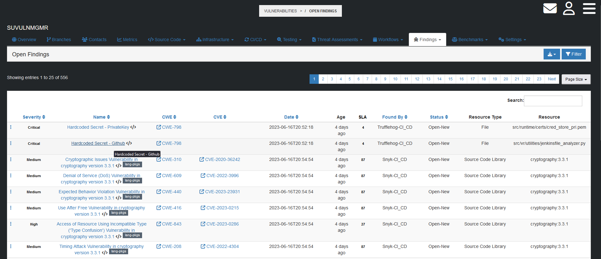

Click on the finding Disposition button, and then click on `Create JIRA Issue`
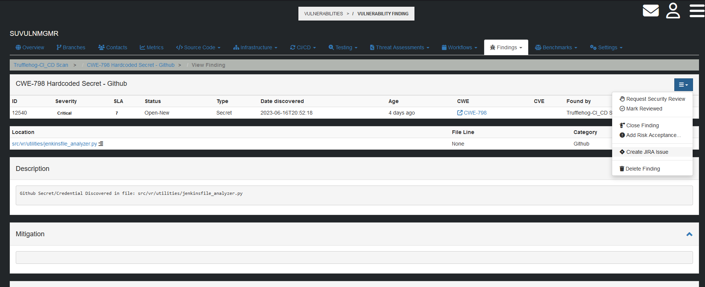

The `Create JIRA Issue` window will pop up.  Modify the Issue Title and Description as needed before clicking on the `Submit` button to create the new issue.
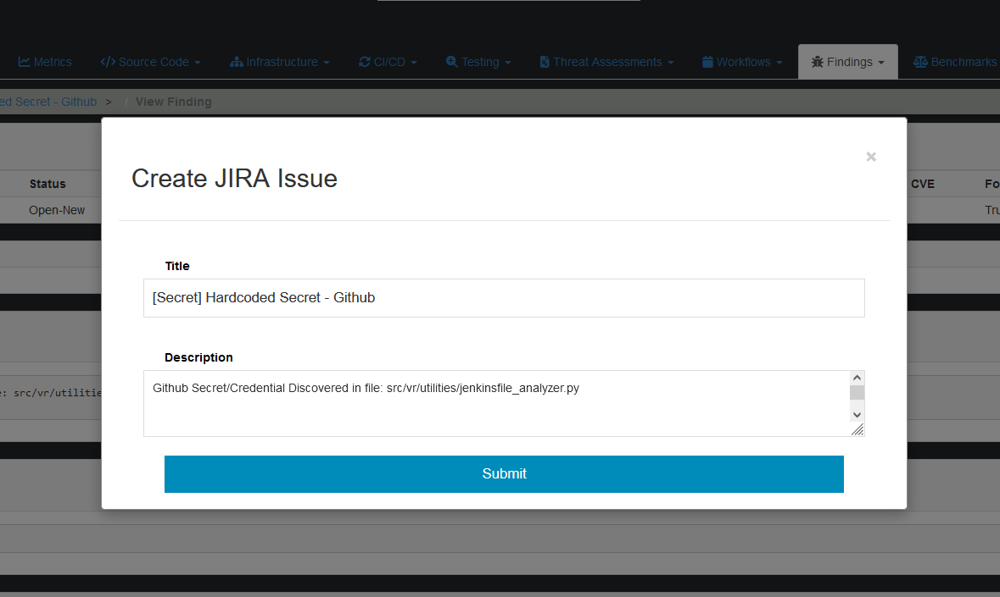

You will be redirected to the Service Ticket list for the application.  Confirm your new issue appears in the list.
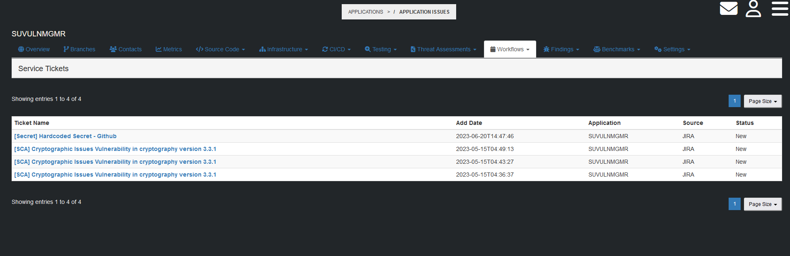

Click on the `Ticket Name` to manage the Issue.
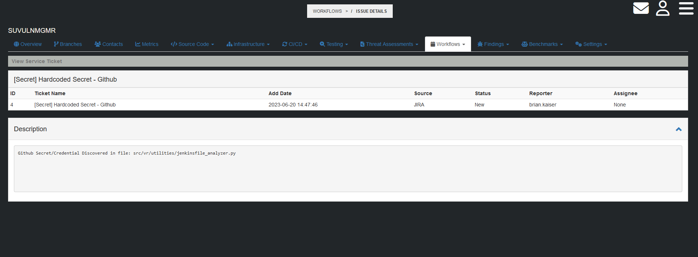

[Back to the Top](#jira-integration-guide)
