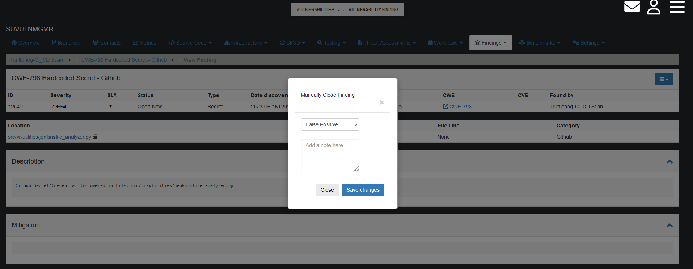

# Managing Vulnerability Findings
[Back to User Guide](./index.md)

To manage Vulnerability Findings, start by navigating to any of the Open Findings tabs.

Next, click on the Name of the Vulnerability that you want to manage.

## Adding a Disposition
Please note, Security Dispositions are only available to users with the Security role assigned.

Disposition Options
* Non-Security Role Dispositions
  * Request Security Review
  * Mark Reviewed
* Security Role Dispositions
  * Close Finding
  * Add Risk Acceptance
  * Delete Finding

To add a disposition to a Vulnerability Finding, click on the blue icon at the top of the `View Finding` table.

You will have the opportunity to add a disposition category and notes before saving.

When a user is assigned a new review as a result of the dispostion, it will appear in the user messages tab.

To conduct the review, click on the `briefcase` button

[Back to the Top](#managing-vulnerability-findings)

## Adding Notes

You can also add Vulnerability Finding-specific notes by scrolling to the bottom of the `View Finding` page.

All notes will be saved at the bottom of the `View Findings` page.

[Back to the Top](#managing-vulnerability-findings)
