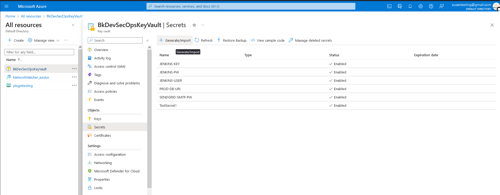
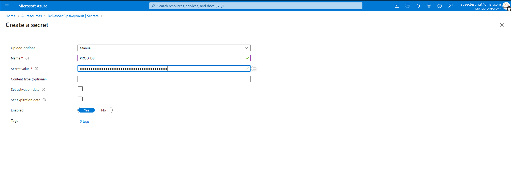
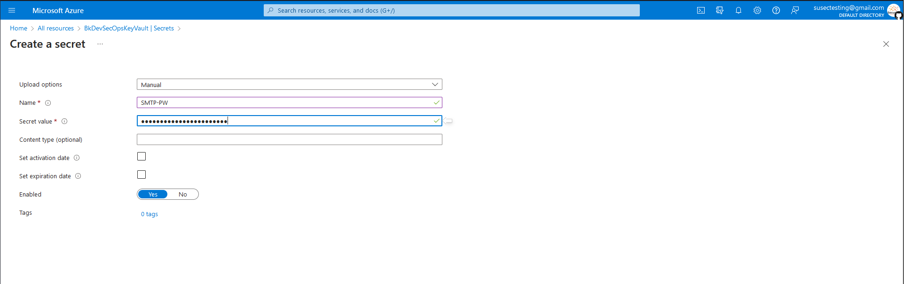

# Production Deployments
[Back to User Guide](./README.md)

Production deployments can be complex and often require customization to the unique aspects of your environment.  If you require additional assistance, please contact Security Universal [support](mailto:admin@securityuniversal.com).

1. Setup Infrastructure
2. Setup Production Credentials
3. Deploy SecuSphere via Helm Charts

## 1. Setup Infrastructure

Requirements
* Azure Kubernetes Services Cluster
* Azure Managed MySQL Database
* SMTP Configuration Details

[Back to the Top](#production-deployments)

## 2. Setup Production Credentials
Currently, Azure is the supported cloud platform for production deployments.

Configure Azure Key Vault
1. In your Azure web console, either navigate to an existing or create a new Key Vault resource.  Be sure to make note of the Key Vault name.
2. Navigate to the Azure Key Vault and select the Secrets tab and then click on the `Generate/Import` tab.

3. First, provide a name for the secret and then add your MySQL Database URI string (ex: mysql+mysqlconnector://[db_user]:[db_password]@[db_host]:[db_port]/VulnRemediator).  Be sure to make note of the name of the secret. 

4. Next, create another secret for the SMTP Password used to send system alerts from SecuSphere.  Again, be sure to make note of the name of the secret.


Clone Repository and Set Configuration Settings
1. Clone the SecuSphere repository be executing the following command:
```shell
$ git clone https://github.com/SecurityUniversalOrg/SecuSphere.git
```
2. Navigate to the source directory and open the settings.py file.
```shell
$ cd src/
$ vi settings.py
```
3. Update lines 4, 6 and 8 with the names of the Azure Key Vault, the Database URI Azure Secret name and the SMTP Password Azure Secret name.
```shell
## Authentication  ##
SET_AUTH_TYPE = 'local'  # options: local, ldap, saml
SET_INSECURE_OAUTH = False
SET_AZURE_KEYVAULT_NAME = 'BkDevSecOpsKeyVault' <---------- ADD AZURE KEYVAULT NAME HERE
SET_ENV = 'test'  # options: test, prod
SET_PROD_DB_URI_REF = 'PROD-DB-URI'    <---------- ADD AZURE SECRET NAME HERE
# Non-Secure Settings - DO NOT USE IN PRODUCTION DEPLOYMENTS
SET_PROD_DB_URI = 'changeme'

##
## Local Instance Settings ##
SET_APP_EXT_URL = '192.168.0.150'

##
## Email Variables ##
SET_SMTP_HOST = 'smtp.sendgrid.net:587'     <---------- UPDATE WITH YOUR SMTP DETAILS
SET_SMTP_USER = 'apikey'     <---------- UPDATE WITH YOUR SMTP DETAILS
SET_SMTP_ADMIN_EMAIL = 'admin@securityuniversal.com'     <---------- UPDATE WITH YOUR SMTP DETAILS
SET_SMTP_PW_REF = 'SENDGRID-SMTP-PW'     <---------- ADD AZURE SECRET NAME HERE
...
```

[Back to the Top](#production-deployments)

## 3. Deploy SecuSphere via Helm Charts
1. From the source code root directory, navigate to the helm directory
```shell
$ cd ci_cd/helm 
```
2. Open the `su-secrets` helm chart by executing the following command:
```shell
$ vi su-secrets/values.html
```
3. Update the values as follows:
```shell
appName: "secusphere"
environment: dev

azClientId: ""     <---------- ADD AZURE CLIENT ID FOR KEY VAULT HERE
azClientSecret: ""     <---------- ADD AZURE CLIENT SECRET FOR KEY VAULT HERE
azTenantId: ""     <---------- ADD AZURE TENANT ID FOR KEY VAULT HERE

imageCredentials:
  username: "dynamic"     <---------- (OPTIONAL) IF USING PRIVATE DOCKER REGISTRY
  password: "dynamic"     <---------- (OPTIONAL) IF USING PRIVATE DOCKER REGISTRY
  email: "dynamic"     <---------- (OPTIONAL) IF USING PRIVATE DOCKER REGISTRY

tls.crt: "dynamic"     <---------- ADD BASE64-ENCODED TLS CERTIFICATE
tls.key: "dynamic"     <---------- ADD BASE64-ENCODED TLS CERTIFICATE PRIVATE KEY

```

4. Open the `su-ingress` helm chart by executing the following command:
```shell
$ vi su-ingress/values.html
```
5. Update the values as follows:
```shell
service:
  port: 5010

ingress:
  serviceName: secusphere
  enabled: true
  annotations:
    kubernetes.io/ingress.class: nginx
    nginx.org/mergeable-ingress-type: "master"
    cert-manager.io/cluster-issuer: bk-selfsigned
    meta.helm.sh/release-name: su-ingress
    meta.helm.sh/release-namespace: securityuniversal
  hosts:
    - host: secusphere-dev.local      <---------- CHANGE THIS VALUE TO YOUR HOSTNAME
      paths: []
  tls: []
```

6. Deploy the Kubernetes secrets resources via Helm:
```shell
helm upgrade su-secrets ./su-secrets -n secusphere -i --values ./su-secrets/values.yaml --create-namespace
```

7. Deploy the Kubernetes Ingress-Controller resources via Helm:
```shell
helm upgrade nginx-ingress ./su-ingress/ingress-nginx -n secusphere -i --values /su-ingress/ingress-nginx/values.yaml
```

8. Deploy the SecuSphere application via Helm:
```shell
helm upgrade secusphere ./secusphere -n secusphere -i --values ./secusphere/values.yaml
```

9. If the deployment was successful, you should be able to reach the web console at https://[your-instance-url]


[Back to the Top](#production-deployments)