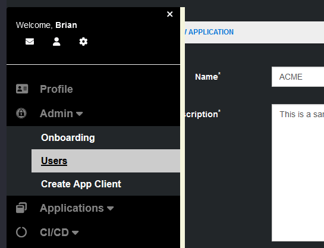
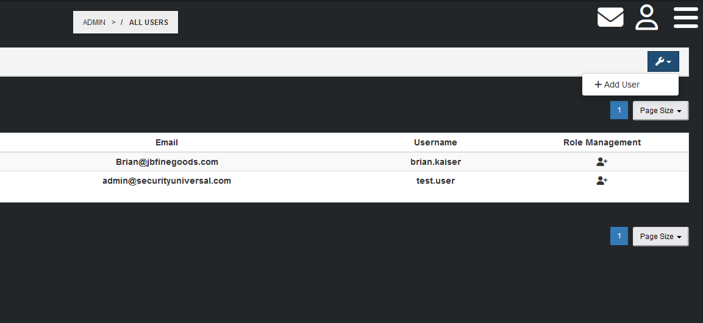
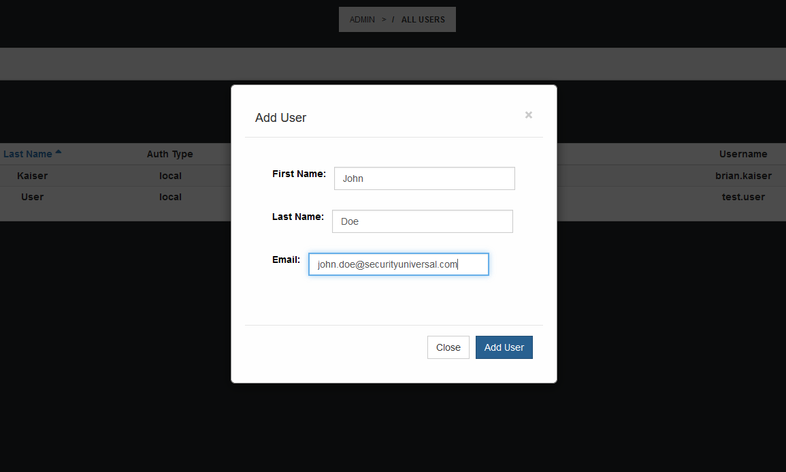
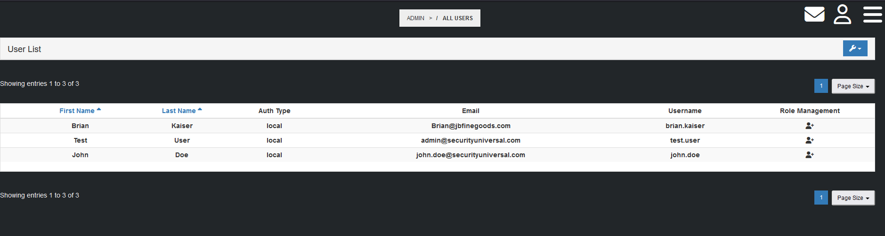
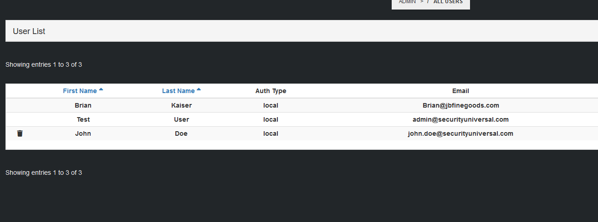
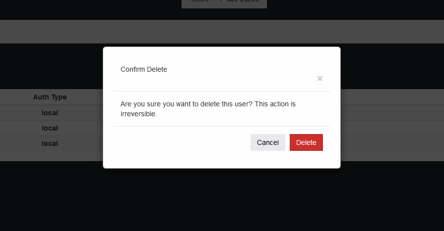
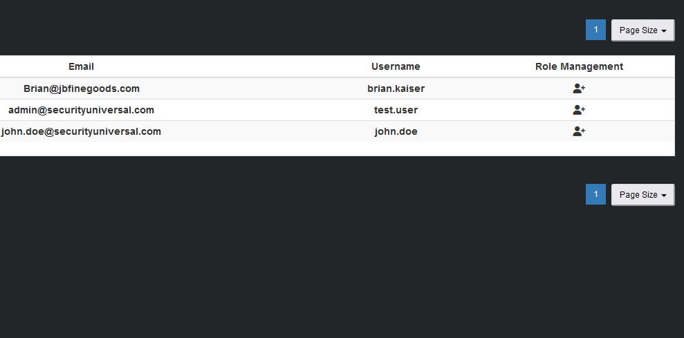
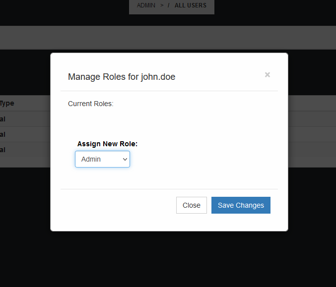
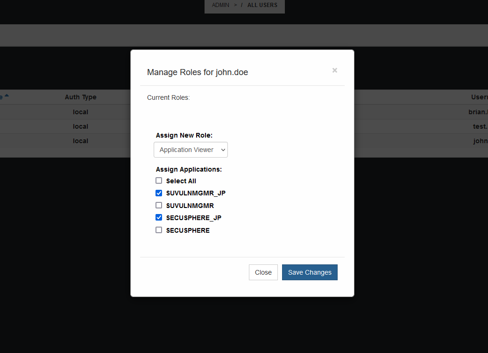

# User Management

To manage Users in SecuSphere, you must have a user with Administrator privileges.

To reach the User Management page, activate the side menu and then click on Admin > Users.

### Add Users
From the User Management page, click on the blue wrench button and then click `+ Add User`.

The `Add User` window will pop up.  Fill out the User details and then click the `Add User` button.

The new User will now appear in the User list.  If you have configured SMTP Integration, the user will recieve an email with login details. 

### Remove Users
From the User Management page, hover over the user row for the user that you would like to remove.

Click on the Trash icon and a Confirmation window will pop up.

Confirm you would like to remove the user by clicking on the `Delete` button.

### Role Management

To manage User Role Assignments, click on the Role Management icon from the User List

The `Manage Roles` window will pop up.  You will see a display of the current assigned roles as well as a list of roles that can be assigned to the user.

When assigning the `Application Viewer` role, you are also required to select specific applications to apply this role to.

Click on the `Save Changes` button to apply the role assignment.