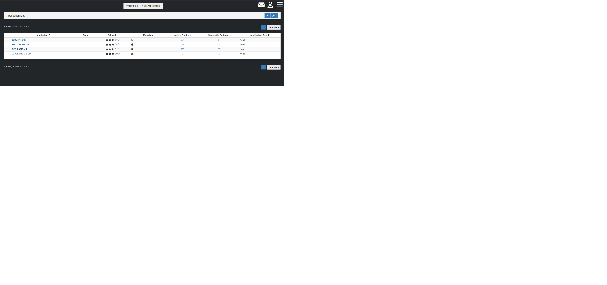
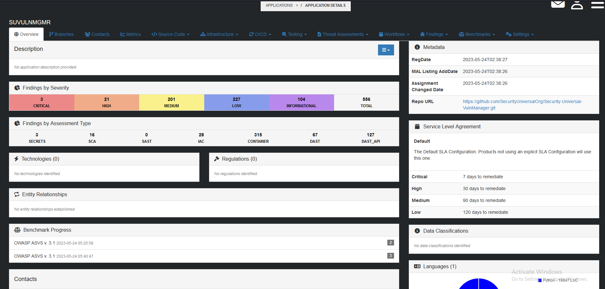
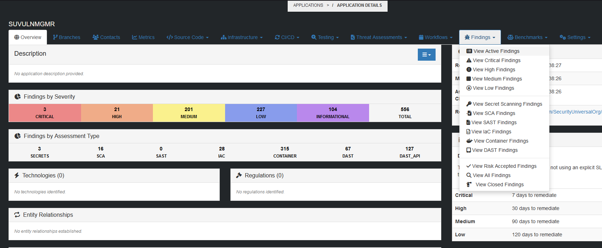
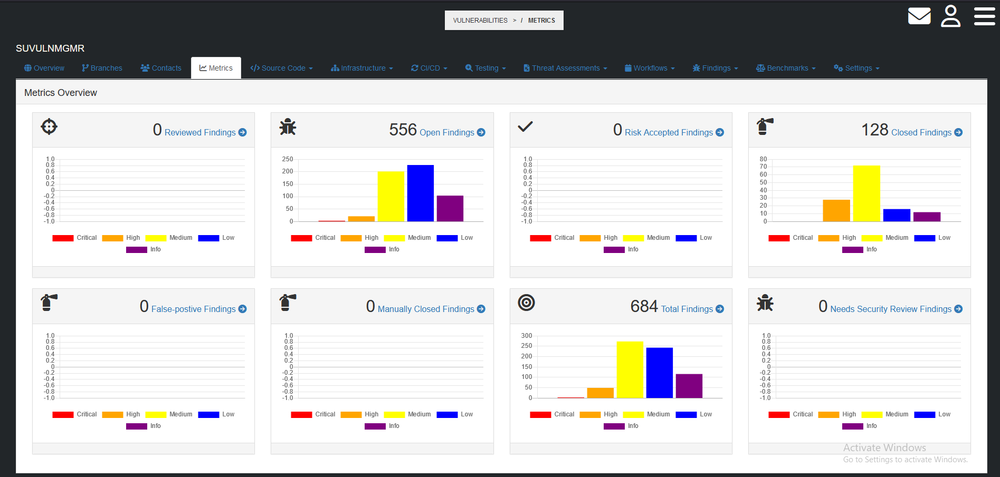

# Viewing Application Status
[Back to User Guide](./index.md)

To view the status of an Application monitored by SecuSphere, start by navigating to the `All Applications` page and then click on the Target Application Profile:

Here, you will find the Application Dashboard which includes a summary of the status of the application.

To view Vulnerability Findings by Severity or Assessment Type, click on the relevant tab.

You can also view Vulnerability Findings by clicking on the `Findings` tab from the application navigation window.

To view Application-specific metrics, click on the `Metrics` tab

[Back to the Top](#viewing-application-status)